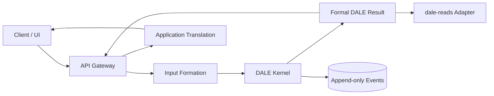

# DALE Kernel Architecture Blueprint

**Status:** Implementation handoff reference  
**Updated:** 2026-08-25  
**Technology:** Python 3.12+, Pydantic 2.x, `uv`  
**Architecture style:** Layered domain services with an event-driven append-only evidence store

## Scope

This document describes the architecture that exists in the repository today.
It distinguishes implemented Kernel behavior from the formal DALE behavior that
is specified by the fellowship documents but still requires adaptation-owned
configuration or mathematical implementation.

The Kernel is responsible for formal processing boundaries, traceability,
runtime state machinery, and formal result construction. It is not the
Jielekeze application, API Gateway, application-translation layer, or
`dale-reads` persistence repository.

## System Context



### Responsibilities

| Component | Owns | Does not own |
|---|---|---|
| API Gateway | Identity, permissions, transport, correlation, retries, request routing | ECOA assignment, ARA completion, formal meaning |
| Input Formation | Source-to-abstract transformation, ambiguity and missingness preservation | Formal ECOA or ARA values |
| `dale-kernel` | Formal boundary validation, admissibility, ECOA/ARA execution, traceability, formal result | UI, recommendations, dashboard composition |
| `dale-reads` | Immutable Reads, Signals, Reports, indexes, historical persistence | DALE mathematics |
| Application Translation | Programs, groups, pathways, dashboards, social proof, user-facing summaries | Authoritative formal state |

## Repository Structure

```text
dale-kernel/
├── main.py                         # Thin production-facing entrypoint
├── examples/
│   └── wt001_demo.py               # Explicit synthetic demo only
├── tests/
│   ├── smoke_test.py               # Current Kernel foundation checks
│   ├── architecture_boundary_test.py
│   ├── ecoa_ara_test.py
│   └── runtime_evidence_test.py
├── src/dale_kernel/
│   ├── core/
│   │   ├── canons.py               # Pydantic domain/result models
│   │   ├── architecture.py         # Project-to-ECOA closure models
│   │   ├── contracts.py            # Gateway request/response envelopes
│   │   └── engine.py               # DALEKernel orchestration boundary
│   └── services/
│       ├── admissibility.py        # Initial input gates
│       ├── traceability.py         # Root/child trace creation and links
│       ├── event_store.py           # Append-only JSONL events
│       ├── input_formation.py      # Pre-ECOA source shaping
│       ├── ecoa.py                 # Partition and declared-rule interface
│       ├── ara_gate.py              # ECOA-to-ARA readiness decision
│       ├── ara_solver.py            # Specification-driven ARA boundary
│       ├── runtime_evidence.py      # WT-002 to WT-007 evidence rails
│       └── state_resolver.py        # Current WT-001 resolver
├── contracts/                      # API and fellowship alignment records
├── docs/                           # Implementation anchors and status docs
├── data/events/                    # Generated local event data
├── pyproject.toml
└── uv.lock
```

## Layered Dependency Rules

```text
core models
    ↑
services
    ↑
engine orchestration
    ↑
API / CLI / examples / tests
```

- Core models must not depend on API transport or application objects.
- Services may depend on core models and other narrowly related services.
- `DALEKernel` coordinates services; it should not contain domain mapping tables.
- Examples and tests may construct synthetic fixtures but must not define
  production behavior.
- `dale-reads` integration belongs behind an adapter and is not part of the
  current Kernel core.

## Core Components

### `canons.py`

Defines Pydantic models for:

- Observation packages and conditions
- Abstract inputs
- Fundamental variables and variable states
- Trace objects and runtime states
- ECOA and ARA output containers
- Formal DALE results
- Value-origin metadata

The models preserve distinctions such as:

```text
ECOA_ASSIGNED != ARA_COMPLETED
NON_ASSIGNED != INFORMATIONAL_ABSENCE
ARCHITECTURAL_INSUFFICIENCY != NON_ASSIGNED
```

The models do not themselves implement the formal mathematics.

### `architecture.py`

Defines the pre-ECOA formal boundary:

```text
ProjectSource
    → StructuralDeclaration
    → BridgeRecord
    → FormalInputPackage
```

The package evaluates closure predicates for structural architecture, bridge
roles, condition, formal keys, transformations, candidate decisions, input
completeness, and trace transparency.

Unclosed or insufficient input routes to architecture review or a blocked
status. It must not silently enter ECOA or ARA.

### `contracts.py`

Defines transport-neutral Gateway envelopes. These preserve request metadata,
source/package references, correlation, idempotency, formal/technical status,
and downstream reference slots without making transport choices such as HTTP,
RPC, queues, or synchronous/asynchronous execution.

### `engine.py`

`DALEKernel.execute()` is the production orchestration boundary:

1. Optional formal-input closure gate
2. Admissibility validation
3. Root and child trace creation
4. Variable-to-trace linking
5. WT-001 state resolution
6. Formal result construction
7. Append-only event recording

The engine accepts caller-supplied `ObservationPackage` and variables. It does
not invent user input or application mappings.

### `input_formation.py`

Preserves source information before formal observation. It currently supports:

- Required-field checks
- Missingness preservation
- Lightweight ambiguity detection
- Source/session references
- Conversion into `AbstractInput` and `ObservationPackage`

AI-assisted extraction is not implemented. Any future AI adapter must remain a
candidate-producing layer behind schema validation and deterministic gates.

### `ecoa.py`

Provides the formal Stage 1 state partition machinery and an
`ObservationRule` protocol. A rule must explicitly return an assignment,
non-assignment, inactivity, or informational-absence decision.

No domain-specific ECOA assignment rules are hardcoded.

### `ara_gate.py` and `ara_solver.py`

The gate returns:

```text
ARA_NOT_REQUIRED
ARA_READY
ARA_BLOCKED
```

The solver framework requires adaptation-owned anchors, domain, penalties,
reconstruction, design package, uniqueness policy, and solver implementation.
It returns a transparent specification-incomplete result when those are absent.

### `runtime_evidence.py`

Provides trace-linked runtime evidence for WT-002 through WT-007:

- Missingness
- Contradiction
- Governance fracture
- Partial adaptation
- Rollback
- Recursive memory
- Combined stress

Anti-collapse checks prevent automatic contradiction selection, governance
signoff, false full coherence, rollback suppression, history rewriting, and
combined-layer flattening.

## Data and Event Architecture

### Formal data flow

```text
Gateway envelope
    → formal input package
    → admissibility
    → ECOA partition
    → ARA readiness
    → formal result
```

### Event store

Events are written as JSONL to:

```text
data/events/<walkthrough-id>/events.jsonl
```

Each event contains an event ID, UTC timestamp, type, walkthrough ID,
sequence number, and payload. The store is append-only. Generated event data is
ignored by Git.

### Result authority

The authoritative formal result must remain distinct from:

- Pathway validation results
- Lateral validation results
- Application translation results
- Dashboard or recommendation objects

## Testing Architecture

Run from the repository root:

```bash
uv sync
PYTHONPATH=$PWD uv run python tests/ecoa_ara_test.py
PYTHONPATH=$PWD uv run python tests/architecture_boundary_test.py
PYTHONPATH=$PWD uv run python tests/runtime_evidence_test.py
PYTHONPATH=$PWD uv run python tests/smoke_test.py
```

### Test boundaries

- `smoke_test.py`: current service and WT-001 orchestration checks
- `architecture_boundary_test.py`: formal input closure and provenance
- `ecoa_ara_test.py`: partition and ARA readiness behavior
- `runtime_evidence_test.py`: WT-002 through WT-007 evidence rails
- `examples/wt001_demo.py`: synthetic demonstration, not a production test

The current tests prove state machinery and boundaries. They do not prove the
formal ECOA mathematics, adaptation-specific mappings, or ARA optimization.

## Error and Resilience Model

The current Kernel returns structured error dictionaries from the execution
boundary and structured errors from the response envelope. It records runtime
events but does not yet implement retries, queues, circuit breakers, or API
authentication. Those belong to the Gateway/integration layer.

Architecture review is a first-class route for unresolved structural conditions.
Missingness and contradiction are evidence states, not automatic failures.

## Deployment and Persistence Status

Current repository behavior is local Python execution with file-based event
storage. No API server, queue, database, container, cloud deployment, or
production `dale-reads` adapter is implemented in this repository.

## Extension Guide

### Add an ECOA observation rule

1. Define a variable registry entry.
2. Implement the `ObservationRule` protocol.
3. Return an explicit `AssignmentDecision` with evidence references.
4. Do not infer inactivity from missing values.
5. Add a focused test for assigned, non-assigned, inactive, and absence states.

### Add an ARA adaptation

1. Provide versioned anchors and admissible domain.
2. Provide architecture and reconstruction penalty references.
3. Provide reconstruction and Stage 2 design references.
4. Provide a uniqueness policy.
5. Supply an adaptation-owned solver.
6. Prove ECOA fixed values are unchanged.
7. Add tests for blocked, non-required, successful, invalid, and non-unique paths.

### Add a WT scenario

1. Start from the corresponding walkthrough-suite registry artifacts.
2. Define the scenario-specific evidence records.
3. Preserve all trace IDs and parent references.
4. Add anti-collapse and dimension-level validation tests.
5. Do not generate signoff, closure, or progression authorization implicitly.

## Current Limitations

Not implemented:

- Formal domain-specific ECOA assignment mathematics
- Adaptation-specific ARA minimization
- Full WT-002 through WT-007 scenario execution
- Validation matrix and failure registry generation
- Governance and human-validation persistence workflows
- Read/snapshot generation
- API server and Gateway transport
- Production persistence or deployment

These are deliberate boundaries, not hidden capabilities. New implementation
should preserve the formal documents’ distinctions and avoid turning provisional
application mappings into Kernel meaning.

## Handoff Checklist

- Read this blueprint and `contracts/api-gateway-integration.md`.
- Read `docs/ECOA_ARA_Implementation_Anchors.md`.
- Run all four test commands above.
- Treat `examples/` as synthetic fixtures only.
- Confirm formal variable and adaptation definitions before implementing rules.
- Keep `dale-reads` persistence behind an explicit adapter.
- Update this document when a component boundary or runtime contract changes.